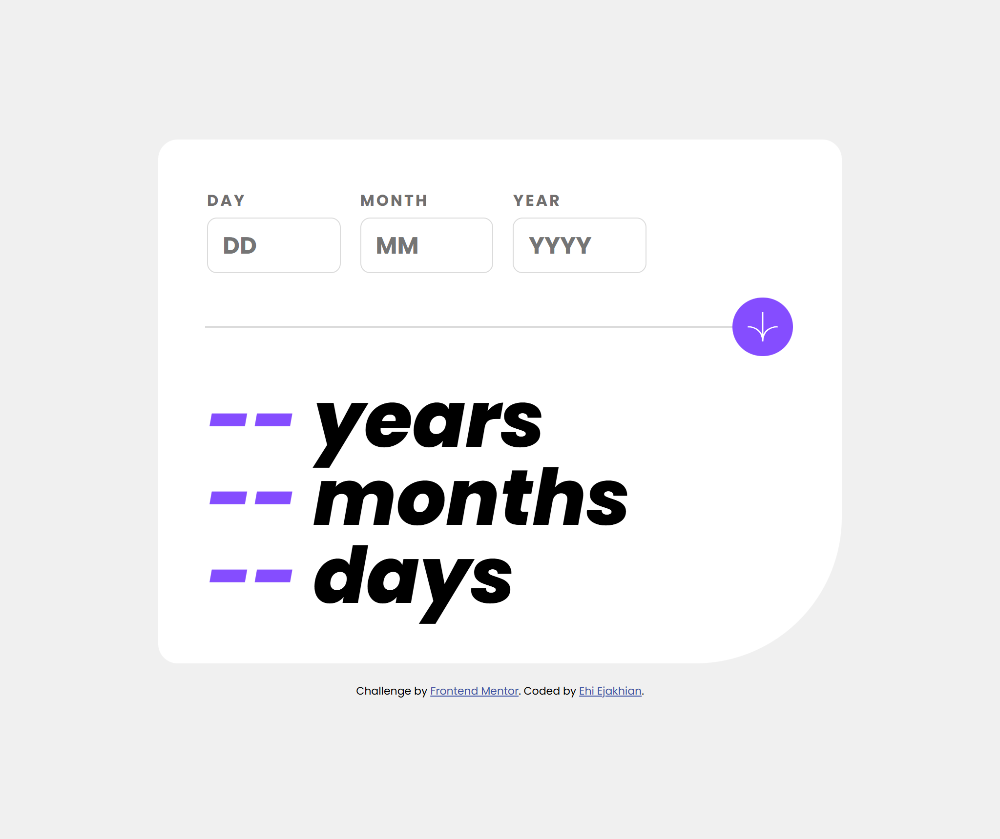
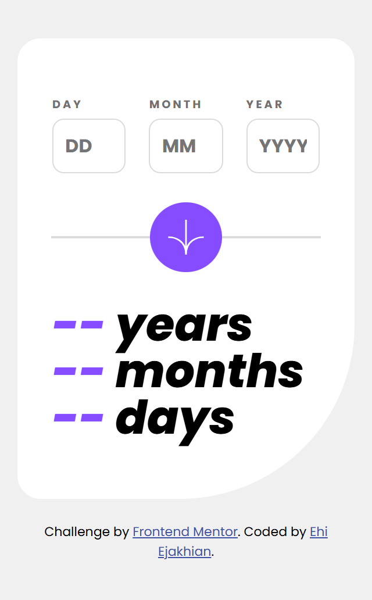

# Frontend Mentor - Age calculator app solution

This is a solution to the [Age calculator app challenge on Frontend Mentor](https://www.frontendmentor.io/challenges/age-calculator-app-dF9DFFpj-Q). Frontend Mentor challenges help you improve your coding skills by building realistic projects. 

## Table of contents

- [Me](#meet-me)
- [Screenshot](#screenshot)
- [My process](#my-process)
  - [Built with](#built-with)
  - [What I learned](#what-i-learned)
  - [Continued development](#continued-development)
  - [Useful resources](#useful-resources)
- [Author](#author)
- [Thanks](#thanks)


## Meet Me
Good day. I'm Ehi. I'm an aspiring developer from Edo, Nigeria. I took this challenge. Here's how I did it and thanks for reading!

## Screenshot
My Desktop Build

My Mobile Build


## My process
After my HTML, I start styling with padding. I set the margin of all elements to zero and then give all elements borders. This helps me visualize all element boundaries - all this I do without adding any color.

Then, I add color, backgrounds and border radii to the assigned elements. I prefer using Comic Sans MS as my font because it feels relaxing to my eyes and it helps me think better. I can't explain it though, it's just a feeling.

Funny and weird, right?😁

### Built with

- Semantic HTML5 markup
- CSS custom properties
- Flexbox
- SCSS
- Mobile-first workflow
- JavaScript

### What I learned
I wanted to loop through time this way. I am indeed proud I could do this. I basically created the function that counts the date from the user input year. But it wasn't quite accurate as I expected. Also, it took time to respond.

```js
var loopingMaxDays
//The main process
function countTime() {
    var loopingDayDate = userInputDate
    var loopingMonthDate = userInputMonth
    var loopingYearDate = userInputYear


    for (loopingYearDate; loopingYearDate <= currentYear; loopingYearDate++) {
        console.log("Brand New year: " + loopingYearDate + "   final date: " + currentYear)
        //check if loop has gotten to the current year
        if (loopingYearDate == currentYear) {
            console.log("current year now")
            //Current year = Yes, if loop has gotten to current monnth
            for (loopingMonthDate; loopingMonthDate <= currentMonth; loopingMonthDate ++) {
                console.log("New Month: " + loopingMonthDate)
                if (loopingMonthDate == currentMonth) {
                    for (loopingDayDate; loopingDayDate <= currentDate; loopingDayDate ++) {
                        console.log(loopingDayDate)
                        ////The date display message
                        if (loopingDayDate == currentDate && loopingMonthDate == currentMonth && loopingYearDate == currentYear) {
                            console.log(currentYear + "/" + currentMonth + "/" + currentDate)
                            display()
                        }
                        ////Day counting ....
                        counterDay()
                    }
        
                } else {
                    checkMaxDay(loopingMonthDate)
                    console.log(loopingMaxDays)
                    for (loopingDayDate; loopingDayDate <= loopingMaxDays; loopingDayDate ++) {
                        console.log(loopingDayDate)
                        counterDay()
                    }
                    loopingDayDate = 1
                }
                ///Month counting ....
                counterMonth()
            }
            
        } else {
            for (loopingMonthDate; loopingMonthDate < 13; loopingMonthDate ++) {
                console.log("New Month: " + loopingMonthDate)
                checkMaxDay(loopingMonthDate)
                console.log(loopingMaxDays)
                for (loopingDayDate; loopingDayDate <= loopingMaxDays; loopingDayDate ++) {
                    console.log(loopingDayDate)
                    counterDay()
                }
                loopingDayDate = 1
                counterMonth()
            }
        }
        console.log("End of: " + loopingYearDate)
        loopingMonthDate = 1
        //Year counting .....
        counterYear()
    }
    numOfDays = 0
    numOfMonths = 0
    numOfYears = 0
}


function checkMaxDay(loopingMonthDate) {
    if (loopingMonthDate == 1) {
        loopingMaxDays = 31
    } else if (loopingMonthDate == 2) {
        loopingMaxDays = 29
    } else if (loopingMonthDate == 3) {
        loopingMaxDays = 31
    } else if (loopingMonthDate == 4) {
        loopingMaxDays = 30
    } else if (loopingMonthDate == 5) {
        loopingMaxDays = 31
    } else if (loopingMonthDate == 6) {
        loopingMaxDays = 30
    } else if (loopingMonthDate == 7) {
        loopingMaxDays = 31
    } else if (loopingMonthDate == 8) {
        loopingMaxDays = 31
    } else if (loopingMonthDate == 9) {
        loopingMaxDays = 30
    } else if (loopingMonthDate == 10) {
        loopingMaxDays = 31
    } else if (loopingMonthDate == 11) {
        loopingMaxDays = 30
    } else if (loopingMonthDate == 12) {
        loopingMaxDays = 31
    }
    ////I want to know if it really checked this function
    console.log("We checked the max days to be " + loopingMaxDays + " and it is true because its the " + loopingMonthDate + " month of the year")
}


let finalNumberOfDays = 0
let finalNumberOfMonths = 0
let finalNumberOfYears = 0


function counterYear(loopingYearDate) {
    ////Year Counter
    if (loopingYearDate != currentYear) {
        numOfYears += 1
    } else {
        numOfYears = numOfYears
    }
    console.log("Number of Years: " + (numOfYears-1))
    finalNumberOfYears = numOfYears
}
function counterMonth(loopingMonthDate) {
    /////Month Counter
    if (loopingMonthDate != 13) {
        numOfMonths += 1
    } else {
        numOfMonths = numOfMonths
    }
    console.log("Number of Months: " + (numOfMonths-1))
    finalNumberOfMonths = numOfMonths
}
function counterDay(loopingDayDate) {
    /////Day Counter
    if (loopingDayDate != 30) {
        numOfDays += 1
    } else {
        numOfDays = numOfDays
    }
    console.log("Number of Days: " + (numOfDays-1))
    finalNumberOfDays = numOfDays
}
```

However, Co-pilot helped me sort things out better. My code became cleaner and more organised.
```js
function calculate() {
  let birthYear = parseInt(inputYear.value);
  let birthMonth = parseInt(inputMonth.value);
  let birthDay = parseInt(inputDay.value);
  let today = new Date();
  let currentYear = today.getFullYear();
  let currentMonth = today.getMonth() + 1;
  let currentDay = today.getDate();

  let years, months, days;

  function getDaysInMonth(year, month) {
    return new Date(year, month, 0).getDate();
  }

  if (birthYear === currentYear) {
    years = 0;
    months = currentMonth - birthMonth;
    days = currentDay - birthDay;
    if (days < 0) {
      months -= 1;
      let prevMonth = currentMonth - 1;
      let prevYear = currentYear;
      if (prevMonth === 0) {
        prevMonth = 12;
        prevYear -= 1;
      }
      days += getDaysInMonth(prevYear, prevMonth);
    }
    if (months < 0) {
      months = 0;
      days = 0;
    }
  } else {
    years = currentYear - birthYear;
    months = currentMonth - birthMonth;
    days = currentDay - birthDay;
    if (days < 0) {
      months -= 1;
      let prevMonth = currentMonth - 1;
      let prevYear = currentYear;
      if (prevMonth === 0) {
        prevMonth = 12;
        prevYear -= 1;
      }
      days += getDaysInMonth(prevYear, prevMonth);
    }
    if (months < 0) {
      years -= 1;
      months += 12;
    }
  }

  if (years === 0 && months === 0 && days === 0) {
    yearResult.innerHTML = `<h1 id="years-result"><span>--</span> years</h1>`;
    monthResult.innerHTML = `<h1 id="months-result"><span>--</span> months</h1>`;
    dayResult.innerHTML = `<h1 id="days-result"><span>--</span> days</h1>`;
  } else if (months === 0 && days === 0) {
    monthResult.innerHTML = `<h1 id="months-result"><span>--</span> months</h1>`;
    dayResult.innerHTML = `<h1 id="days-result"><span>--</span> days</h1>`;
  } else {
    if (years === 1) {
      yearResult.innerHTML = `<h1 id="years-result"><span>${years}</span> year</h1>`;
    } else {
      yearResult.innerHTML = `<h1 id="years-result"><span>${years}</span> years</h1>`;
    }

    if (months === 1) {
      monthResult.innerHTML = `<h1 id="months-result"><span>${months}</span> month</h1>`;
    } else {
      monthResult.innerHTML = `<h1 id="months-result"><span>${months}</span> months</h1>`;
    }

    if (days === 1) {
      dayResult.innerHTML = `<h1 id="days-result"><span>${days}</span> day</h1>`;
    } else {
      dayResult.innerHTML = `<h1 id="days-result"><span>${days}</span> days</h1>`;
    }
  }
}
```

### Continued development
I would love to learn more about how to use functions and methods better. I thought I'd already passed that level, but the thing is one never stops learning. That's why I think I got stuck creating large loop code blocks.

### Useful resources

- [W3Schools JavaScript Dates Tutorial](https://www.w3schools.com/js/js_dates.asp) - This tutorial helped me grasp the date functions and methods. It is really helpful!

For now I don't have a website of my own, but I am working on having one soon. I'll also need all the help I can get on this one. It's very important.
- Frontend Mentor - [@EhiEjakhian](https://www.frontendmentor.io/profile/EhiEjakhian)
- Chat me on Whatsapp - [Ehi Ejakhian](https://wa.me/+2348142340182?text=Hello%20Ehi%20.%20I%20checked%20your%20Age%20Calculator%20App%20solution!)
- LinkedIn - [Ejakhian Ehi](https://ng.linkedin.com/in/ehi-ejakhian-2302a7318)

I'm also an aspiring comic and sketch artist, so if you have any gigs or if you can relate, check me up on whatsapp and see my art.

# Thanks!
Thank you for going through this. I really hope I did good to your taste, if not please tell me how to improve on the comments section of my solution. Thanks again!
